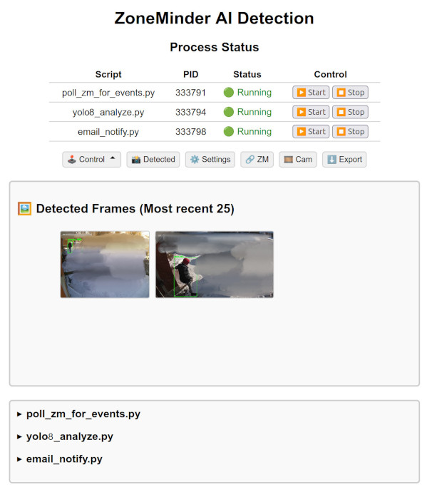
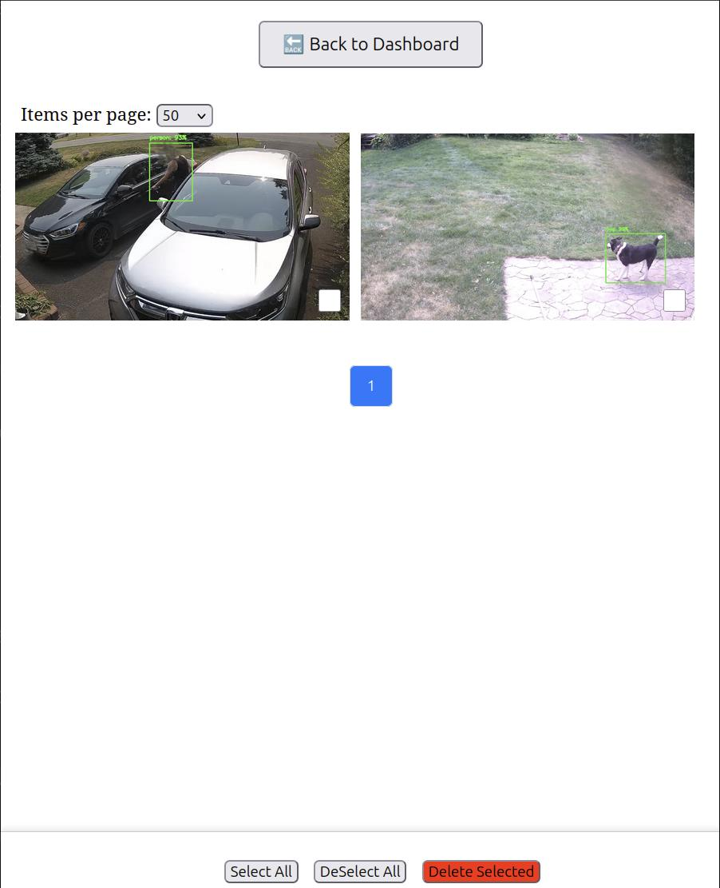
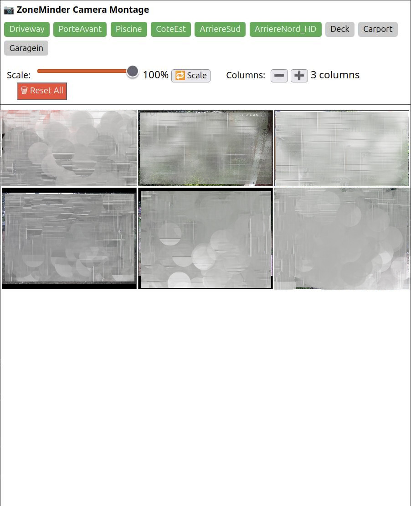

Zoneminder python scripts using fastAPI (cross platform) that can run on any machine with a Nvidia GPU. No need to any modifications to the ZM machine, uses the ZM API's only.

The need came from only having a Nvidia GPU on another machine from ZM.

In short, zm_ai uses 4 scripts that can run independently
1) poll_zm_for_events.py (polls zoneminder events every 10 seconds)
2) yolo8_analyze.py (AI detection using yolo8 on ZM event video)
3) email_notify.py (Optional, emails stills of detections)
4) zm_ai.apy (Dashboard to the above)

The dashboard also includes:
- Camera montage option (mjpeg and push jpeg to get around browser limitations) 
- Detection image management
- Settings (note: email settings have to be changed in the file directly)
- Link to zoneminder
- Script control

### Dashboard

### SETUP
1) Setup in a folder say zm_ai:
setup_zm_ai.ps1 (windows terminal/powershell)
or
./bash setup_zm_ai.sh (Ubuntu Linux)

This will hopefully download all pip requirements, pytorch and yolo8 and activate the python environment
*** ensure you have plenty of space because yolo8, pytorch and opencv takes a lot of disc space ***

2) Start the script
Review settings.ini and email_settings.ini to match your installation (or do this later through the front end)

execute start_zm_ai.(ps1|sh)

This will activate the python environment and execute the zm_ai.py script. 
All other script should start automatically and be manage from the dashboard.

3) Go to your browser and enter http://localhost:8001/zm_ai
*** Adjust settings as required.

4) For reverse proxy zm_ai.py through apache to serve zm_ai.py through the internet
** Note that the communication between the zm_ai.py and zoneminder machines are not encrypted so keep them on a local network.

<VirtualHost *:443>
    ServerName otherserver
    ProxyPreserveHost On
    RewriteEngine on

    # FastAPI

    ProxyPass /zm_ai http://192.168.1.10:8001/zm_ai
    ProxyPassReverse /zm_ai http://192.168.1.10:8001/zm_ai

    # redirect HTTP to HTTPS
    RewriteEngine On
    RewriteCond %{HTTPS} off
    RewriteRule ^ https://%{HTTP_HOST}%{REQUEST_URI} [L,R=301]
</VirtualHost>

