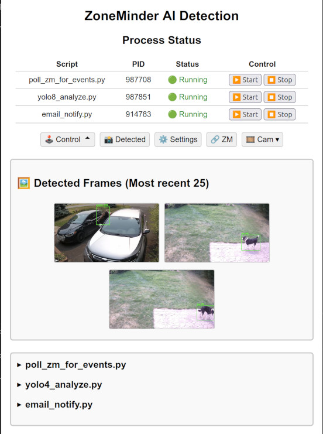

Zoneminder python scripts using fastAPI that can run on ANY computer (windows, linux) with a Nvidia GPU independently of the zoneminder hardware. No need to any modifications to the ZM machine, uses the ZM API's only.

Tested under ubuntu 24.04/windows 11 with python 3.12 and zoneminder 1.37.68 with or without apache basic auth enabled and zoneminder builtin OPT_USE_AUTH enabled. Zoneminder API have to be enabled.

The need came from my zoneminder computer not having a GPU. So this uses my other desktop (with NVIDIA GPU) to do the analysis over the network.

In short, zm_ai uses 4 scripts that can run independently
1) poll_zm_for_events.py (polls zoneminder events every 10 seconds)
2) yolo8_analyze.py (AI detection using yolo8 on ZM event video)
3) email_notify.py (Optional, emails stills of detections)
4) zm_ai.py (Dashboard to the above)

The dashboard also includes:
- Quick snapshot of latest detection
- Detection image file management
- Settings (note: email settings have to be changed in the file directly)
- Link to zoneminder
- Script control
- Log review
- Camera montage option mjpeg and snap (snap = push jpeg meant to be proxied) <-- under development

### Dashboard



### SETUP
1) Setup in a folder say zm_ai:
setup_zm_ai.ps1 (windows terminal/powershell)
or
./bash setup_zm_ai.sh (Ubuntu Linux)

Recommend to install python 3.10 - 3.12

This will download all pip requirements, pytorch and yolo8 (ultralytics) and activate the python environment
*** ensure you have plenty of space because yolo8, pytorch and opencv takes a lot of disc space ***

2) Start the script
Review settings.ini and email_settings.ini to match your installation (or do this later through the front end)

execute start_zm_ai.(ps1|sh)

This will activate the python environment and execute the zm_ai.py script. 
All other script should start automatically and be manage from the dashboard.

3) Go to your browser and enter http://localhost:8001/zm_ai
*** Adjust settings as required.

4) If you have access to your zoneminder computer through the internet, you can reverse proxy zm_ai.py through apache.
** Note that the communication between the zm_ai.py and zoneminder machines are not encrypted so I recommend to keep those on a local network. Unsure about how safe this reverse proxy is. Use at own risk.

SETTINGS.INI

[general]\
mon_camid = 1,2,3 # Cameras to monitor\
zm_host = https://192.168.1.10:443 # host of zoneminder machine. Assumes /zm and /zm/api. Can be http or https, any ports\
log_enable = True\
log_retention_days = 1

[paths] # Folders relative to location of python scripts\
zm_alarm_queue = to_be_processed\
zm_ai_detections_dir = detected_frames\
yolo_config_path = yolo

[credentials]\
zm_user = zm_user # Zoneminder use_auth\
zm_pass = zm_pass\
bauth_user = bauth_user # apache basic auth\
bauth_pwd = bauth_pass

[detection]\
use_gpu = True # always true, not used\
use_box = True\
confidence_threshold = 0.80\
obj_list = person, bird, cat, dog # from coco.txt\
threshold = 10 # will skip analyzing events if rate exceeds threshold/time_window (e.g. 10 Events/60s)\
time_window = 60

[email]\
email_batch_interval = 60 (wait in seconds before emailing. Prevents getting bunch of emails.\
email_camid = 2

```apache
<VirtualHost *:443>
    ProxyPreserveHost On
    RewriteEngine on

    # FastAPI/zm_ai

    # Optional: redirect HTTP to HTTPS
    RewriteCond %{HTTPS} off
    RewriteRule ^ https://%{HTTP_HOST}%{REQUEST_URI} [L,R=301]

    # Pass X-Forwarded-Proto so FastAPI knows the original scheme
    RequestHeader set X-Forwarded-Proto "https"

    #
    ProxyPass /zm_ai http://192.168.1.XXX:YYYY/zm_ai
    ProxyPassReverse /zm_ai http://192.168.1.XXX:YYYY/zm_ai

</VirtualHost>
```

*** I am not a programmer so constructive comments welcomed.
